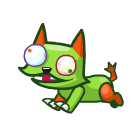
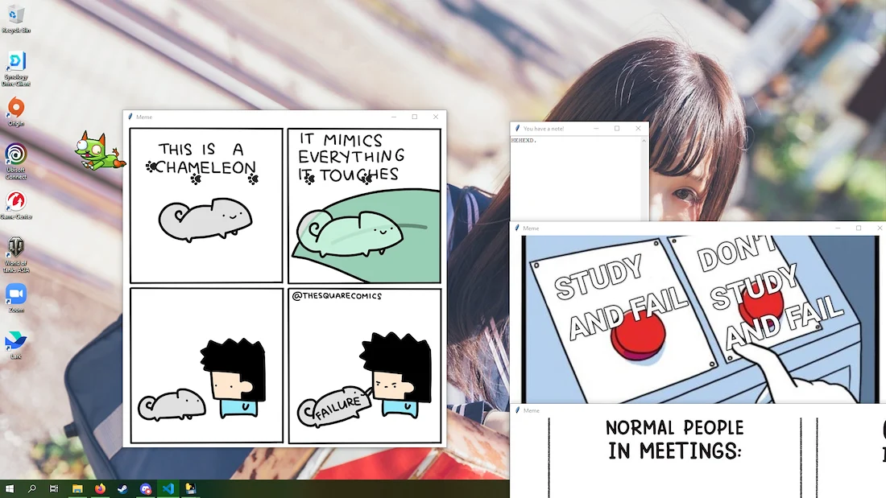

# Derpat (Derpy Cat) the Annoying Desktop Pet
Ever wanted a desktop pet that will annoy you all the time? Me neither, which is why we created one. 

Derpat is a desktop pet that will reduce your productivity to an all-time low. The perfect productivity pet.

*This is not malware we swear UwU*

# Preview of Derpat
<figure>
    
     
    <figcaption align = "center">
      <i>Click on the image to watch the trailer video.</i>
    </figcaption>
</figure>

# References
Basic Tutorial: https://seebass22.github.io/python-desktop-pet-tutorial/  
Handling Mouse Input: https://pythonhosted.org/pynput/mouse.html  

# Keyboard Shortcuts
Quitting the Application: CTRL + ALT + 2 + 9 + Y (Yes, it is possible.)  

# Dependencies:
Screen Information: pip install screeninfo  
Mouse: pip install pynput  
Keyboard: pip install keyboard  
Window Movement: pip install pywin32  
Audio: pip install playsound==1.2.2  
Packaging Tool: pip install pyinstaller  

# Supported Platforms
Currently, Derpat only works on Microsoft Windows.  

# Assets
Free icons from https://icon-icons.com/.  
Memes from Google Images.  

# Customisability
Want to customise Derpat? Want to replace it with another pet? Derpat is fully customisable!  
Edit `src/assets/data/asset_params.txt`, `src/assets/data/note_params.txt` and `src/assets/data/state_params.txt` to change the look and behaviour of Derpat.

Want more memes?  
Just add more `.png` files to `src/assets/images/`.
